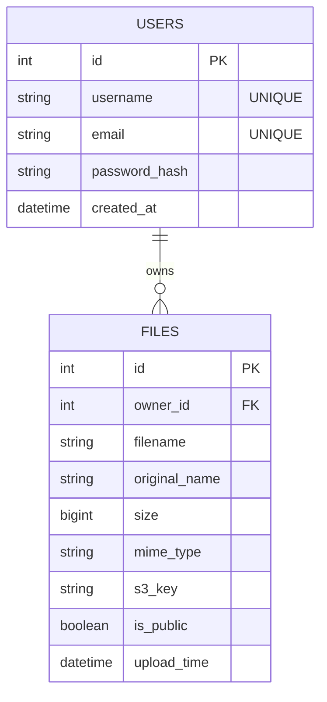
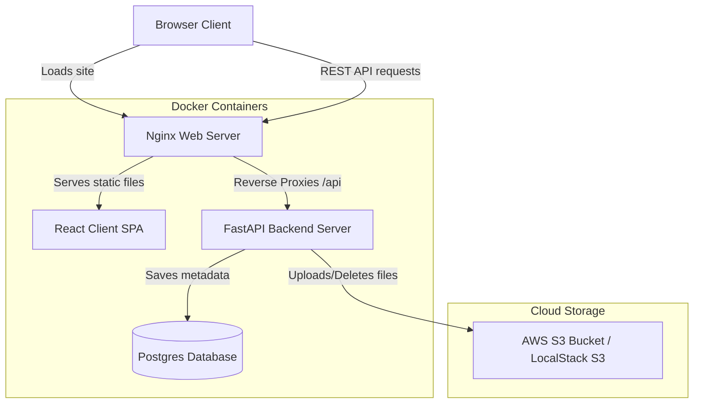
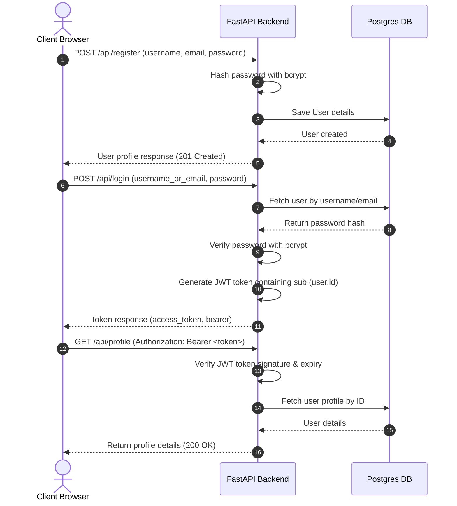
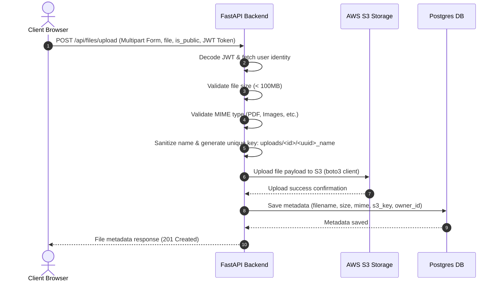
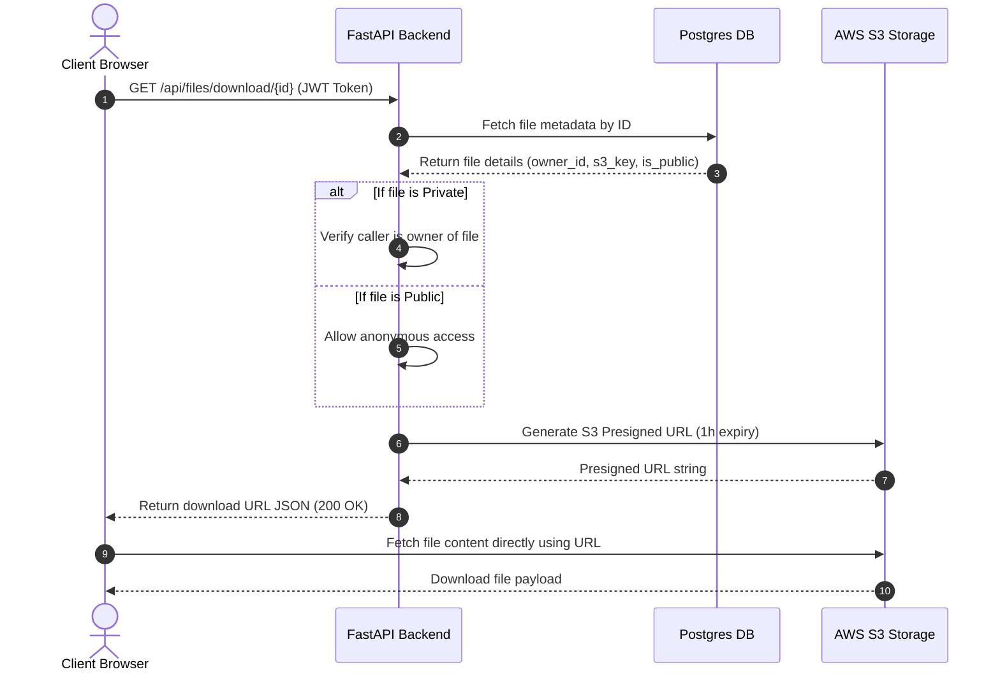

# System Architecture & Diagrams

This document contains visual diagrams describing the database structure, components, and communication flows of the Cloud File Storage web application.

---

## Entity-Relationship (ER) Diagram

The following ER diagram maps the database structure containing two tables: `users` and `files`. It shows a one-to-many relationship where each user can own multiple files, but each file belongs to exactly one user.

---

## System Architecture Diagram

The frontend is served via an Nginx container which also reverse-proxies API calls `/api` to the backend. Files are uploaded directly to the backend, which uploads them to S3 and registers the file details inside PostgreSQL.

---

## Sequence Diagrams

### 1. Registration & Authentication Lifecycle
How a guest registers, logs in, obtains a JWT token, and accesses protected endpoints:

### 2. File Upload Lifecycle
How files are uploaded, validated for size/type, and secured against path traversals:

### 3. File Download Lifecycle
How downloads are authorized and securely routed, supporting public/private flag states:

